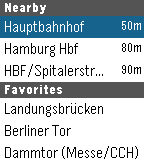
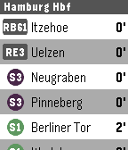
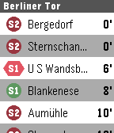
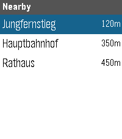
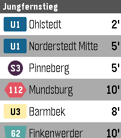

# HVV Departures for Pebble

A Pebble smartwatch app that displays real-time HVV (Hamburger Verkehrsverbund) transit departures. Shows nearby stops via GPS and lets you save favorite stations for quick access.

<p align="center">
  
  &nbsp;&nbsp;
  
  &nbsp;&nbsp;
  
</p>

<p align="center">
  
  &nbsp;&nbsp;
  
</p>

## Features

- **Nearby stops** — automatically finds the 3 closest stops using your phone's GPS
- **Favorite stops** — configure up to 5 favorite stations via the phone settings page
- **Real-time departures** — shows line, destination, and minutes until departure with auto-refresh every 30 seconds
- **Line-colored badges** — S-Bahn and U-Bahn lines use their official HVV colors with distinct shapes per transport type:
  - U-Bahn: square
  - S-Bahn: circle
  - Bus: hexagon
  - Ferry: trapezoid
- **All rectangular Pebble platforms** — supports aplite, basalt, diorite, and emery (color and B&W)

## Setup

### 1. Get GTI API credentials

The app uses the [Geofox Thin Interface (GTI)](https://gti.geofox.de/) API provided by HVV. To get API credentials:

1. Visit [gti.geofox.de](https://gti.geofox.de/)
2. Apply for API access
3. You will receive a username and password

Without credentials, the app shows demo data so you can preview the UI.

### 2. Build and install

Requires the [Pebble SDK](https://developer.rebble.io/developer.pebble.com/sdk/index.html).

```bash
pebble build
pebble install --phone <PHONE_IP>
```

### 3. Configure

Open the Pebble app on your phone, go to the HVV Departures settings, and enter:

- **Favorite stops** — station names as shown on hvv.de (e.g. "Jungfernstieg", "Hauptbahnhof")
- **GTI Username** and **GTI Password** — your API credentials

## How it works

1. The app opens to a station list showing nearby stops (via GPS) and your favorites
2. Select a station to view its departures
3. Departures auto-refresh every 30 seconds
4. Press back to return to the station list

## Development

```bash
pebble build                              # Build for all platforms
pebble install --emulator basalt          # Install to emulator
pebble screenshot --emulator basalt       # Take a screenshot
pebble logs --emulator basalt             # View JS and C logs
```

The emulator uses Hamburg Hbf as a fake GPS location for testing.

## Architecture

- **Watch (C):** Station list window, departure scroll view, programmatic transit icons, AppMessage communication
- **Phone (JS):** GTI API calls with HMAC-SHA1 auth, GPS location, Clay configuration page
- **Config:** Clay framework for favorite stops and API credentials
